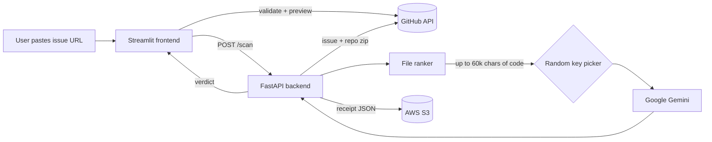

<div align="center">

# 🧭 Code Sherpa

**Paste a GitHub issue link. Get a beginner-friendly guide to the bug: why it happens, where it lives, and how to fix it.**


[Live Demo](https://frontend-6.streamlit.app/) ·

<!-- Replace with a real screenshot or a 10-15 second GIF of one full scan -->


</div>

---

## The Problem

Open-source contribution is intimidating. A beginner opens an issue, sees a wall of jargon, lands in a repository with hundreds of files, and gives up before finding the first relevant line.

## The Solution

Code Sherpa reads the issue **and** the actual repository, finds the few files that matter, and explains the bug in plain language, with one real-life analogy, the exact file to open, a minimal fix, and why it matters.

No cloning. No setup. Paste a link and get a starting point.

---

## Features

- **Beginner-first explanations.** Short sentences, jargon explained in brackets, one analogy, an encouraging tone.
- **Grounded in real code.** The model only sees files from the repository and is instructed never to invent files, functions or line numbers. If the evidence is thin, it says so and labels its answer as a guess.
- **Smart file selection.** Instead of dumping a whole repo into the model, files are ranked by relevance to the issue and the best ones fill a fixed budget (see [How files are chosen](#how-files-are-chosen)).
- **Multi-key Gemini routing.** Provide several Gemini API keys; each request uses one picked at random, so no single key's quota gets used up.
- **Transparent UI.** Live pipeline stages, elapsed time, issue preview, downloadable verdict (`.md`), and a beginner guide on finding an issue URL.
- **Cold-start aware.** The frontend detects a sleeping free-tier backend and waits for it to wake instead of failing.
- **Hardened by default.** Only `github.com` issue URLs are accepted (no arbitrary outbound requests), repos are processed in memory, and issue and code text is treated as data, not instructions.
- **Audit receipts on AWS S3.** Every successful scan is saved as a timestamped JSON receipt (issue URL, verdict, time) in your S3 bucket.

---

## How It Works



1. **Validate.** The frontend parses the URL locally and rejects pull requests and malformed links.
2. **Preview.** It fetches issue metadata (title, state, comment count) from GitHub to show while the analysis runs.
3. **Wake.** It pings the backend until it responds (free-tier hosts sleep when idle).
4. **Scan.** `POST /scan` sends the URL to the backend.
5. **Fetch.** The backend reads the issue and downloads the repository zip into memory. Nothing is written to disk.
6. **Rank.** Files are scored against the issue text and the best ones are packed into a fixed character budget.
7. **Explain.** One randomly chosen Gemini key analyses the issue and code with a strict mentor-style prompt.
8. **Receipt.** The verdict is saved to S3 (if configured) and returned to the UI.

### How files are chosen

| Signal | Effect on score |
|---|---|
| File path is mentioned in the issue text | **+100** and a larger per-file budget (15,000 chars) |
| Issue keyword appears in the file path | +5 per keyword |
| Issue keyword appears in the file content | +3 per keyword |
| File is in a test folder or looks like a test file | −8 |
| Markdown or text file | −5 |

Keywords are the most frequent meaningful words in the issue (the title counts double; common stopwords are ignored). Dependency folders, build output, lockfiles and minified files are skipped entirely.

### Safeguards and limits

| Protection | Value |
|---|---|
| Accepted URLs | `github.com` or `api.github.com` issue links only |
| Max repository archive | 100 MB |
| Max single file | 200 KB |
| Max files scanned per repo | 5,000 |
| Max issue description sent | 8,000 chars |
| Max code sent to the model | 60,000 chars |
| Gemini retries | 3 attempts on 429 / 503 (waits 4s, then 8s) |
| Prompt-injection hardening | Issue and code text are wrapped in tags and stripped of look-alike tags; the model is told to treat them as data |

---

## Tech Stack

| Layer | Technology |
|---|---|
| Frontend | Streamlit, custom CSS |
| Backend | FastAPI, Uvicorn, Pydantic |
| AI | Google Gemini (`google-genai`) with multi-key routing |
| Source data | GitHub REST API |
| Storage | AWS S3 via `boto3` (scan receipts) |
| Hosting | Render (backend), Streamlit Community Cloud (frontend) |

---

## Getting Started

### Prerequisites

- Python 3.10+
- At least one [Gemini API key](https://aistudio.google.com/apikey)
- An AWS S3 bucket plus IAM credentials for scan receipts (see [AWS S3 Setup](#aws-s3-setup))
- Optional: a GitHub personal access token

### 1. Clone

```bash
git clone https://github.com/YOUR-USERNAME/code-sherpa.git
cd code-sherpa
```

### 2. Run the backend

```bash
cd backend
python -m venv .venv
source .venv/bin/activate        # Windows: .venv\Scripts\activate
pip install -r requirements.txt

cp .env.example .env             # then edit .env and add your keys
python engine.py
```

The API is now live at `http://localhost:10000` (interactive docs at `/docs`).

### 3. Run the frontend

In a second terminal:

```bash
cd frontend
python -m venv .venv
source .venv/bin/activate        # Windows: .venv\Scripts\activate
pip install -r requirements.txt

mkdir -p .streamlit
cp .streamlit/secrets.toml.example .streamlit/secrets.toml   # set BACKEND_URL to http://localhost:10000
streamlit run app.py
```

Open `http://localhost:8501`, paste an issue link such as `https://github.com/owner/repo/issues/123`, and click **Analyze issue**.

### 4. Or test the API directly

```bash
curl -X POST http://localhost:10000/scan \
  -H "Content-Type: application/json" \
  -d '{"github_url": "https://github.com/owner/repo/issues/123"}'
```

---

## Configuration

### Backend (`backend/.env`)

| Variable | Required | Description |
|---|---|---|
| `GEMINI_API_KEY` | **Yes** | One key, or several separated by commas. A random one is used per request. |
| `GEMINI_MODEL` | No | Gemini model ID. Defaults to `gemini-3.6-flash`. |
| `GITHUB_TOKEN` | No | Raises the GitHub rate limit and enables private repositories. |
| `MY_BUCKET_NAME` | **Yes** | S3 bucket where scan receipts are saved. |
| `MY_ACCESS_KEY` | **Yes** | Access key ID of the IAM user that writes receipts. |
| `MY_SECRET_KEY` | **Yes** | Matching AWS secret access key. |
| `AWS_REGION` | No | Region of the bucket. Defaults to `ap-south-1`. |

> If the S3 variables are missing, scans still complete but no receipt is written (`receipt_saved` comes back `false`).

### Frontend (env var or `frontend/.streamlit/secrets.toml`)

| Variable | Required | Description |
|---|---|---|
| `BACKEND_URL` | No | Base URL of the backend. Set to `http://localhost:10000` for local development. |
| `GITHUB_TOKEN` | No | Raises the issue-preview lookup limit from 60 to 5,000 requests per hour. |

> Never commit `.env` or `secrets.toml`. Both are listed in `.gitignore`.

---

## AWS S3 Setup

Each successful scan writes one JSON file to `receipts/scan_<timestamp>_<id>.json` in your bucket.

1. Create an S3 bucket in your chosen region and keep **Block all public access** turned on.
2. Create an IAM user with this minimal policy (replace `YOUR-BUCKET`):

```json
{
  "Version": "2012-10-17",
  "Statement": [{
    "Effect": "Allow",
    "Action": "s3:PutObject",
    "Resource": "arn:aws:s3:::YOUR-BUCKET/receipts/*"
  }]
}
```

3. Create an access key for that user and set `MY_ACCESS_KEY`, `MY_SECRET_KEY`, `MY_BUCKET_NAME` and `AWS_REGION` in the backend environment.

Example receipt:

```json
{
  "searched_link": "https://github.com/owner/repo/issues/123",
  "bug_verdict": "### 🔍 What's Going Wrong? (Root Cause)\n...",
  "time_scanned": "2026-09-20T10:15:30+00:00"
}
```

---

## API Reference

### `POST /scan`

**Request**

```json
{ "github_url": "https://github.com/owner/repo/issues/123" }
```

**Response `200`**

```json
{
  "status": "success",
  "searched_url": "https://github.com/owner/repo/issues/123",
  "verdict": "### 🔍 What's Going Wrong? (Root Cause)\n...",
  "receipt_saved": true
}
```

**Errors**

| Code | Meaning |
|---|---|
| `400` | Not a valid GitHub issue URL |
| `404` | Issue or repository not found (or private without `GITHUB_TOKEN`) |
| `413` | Repository archive is larger than 100 MB |
| `429` | GitHub rate limit reached |
| `500` | `GEMINI_API_KEY` is not configured |
| `502` | GitHub or Gemini returned an error, or the archive was corrupted |
| `503` | Gemini is overloaded after all retries |

### Verdict format

Every verdict follows the same four-part structure (under about 300 words):

```
### 🔍 What's Going Wrong? (Root Cause)   → plain-language cause + one analogy
### 📁 Where is the Bug?                   → file, function, line numbers
### 🛠️ How to Fix It                       → numbered steps + minimal code change
### ⚠️ Why This Matters (Impact)           → real-world consequence
```

<!-- Optional: paste a real verdict from a well-known issue here -->

---

## Deployment

**Backend on Render**

| Setting | Value |
|---|---|
| Root directory | `backend` |
| Build command | `pip install -r requirements.txt` |
| Start command | `python engine.py` |
| Environment | Everything from the backend table above |

**Frontend on Streamlit Community Cloud**

| Setting | Value |
|---|---|
| Main file path | `frontend/app.py` |
| Secrets | `BACKEND_URL = "https://your-backend.onrender.com"` |

Free-tier backends sleep when idle. The frontend shows a live "waking server" timer, so the first request after a pause may take up to about a minute.

---

## Project Structure

```
code-sherpa/
├── backend/
│   ├── engine.py               # FastAPI app: GitHub fetch, file ranking, Gemini, S3 receipts
│   ├── requirements.txt
│   └── .env.example
├── frontend/
│   ├── app.py                  # Streamlit UI
│   ├── requirements.txt
│   └── .streamlit/
│       └── secrets.toml.example
├── assets/                     # screenshots and demo GIF
├── .gitignore
├── LICENSE
└── README.md
```

---

## Privacy Notes

- Repository code is processed **in memory** on the backend and is never written to disk.
- The selected issue text and code excerpts are sent to Google Gemini for analysis.
- Each successful scan stores only the issue URL, the generated verdict and a timestamp in your S3 bucket.

## Known Limitations

- Analyses **issues only**; pull requests are rejected with a helpful message.
- Sends at most about 60,000 characters of code, so very large or sprawling bugs may get a best-guess answer (the model is instructed to say so).
- Reads text and source files only; binaries and files over 200 KB are skipped.
- Key selection is random per request and does not yet skip a key that is currently rate-limited.
- AI explanations can be wrong. Always verify a suggested fix before merging.

## Roadmap

- [ ] Swap Gemini for AWS Bedrock (the analysis step is isolated in one function)
- [ ] Health-aware key rotation: skip a rate-limited key and retry with another
- [ ] Pull request explainer
- [ ] Cache results per issue to save API quota
- [ ] "Good first issue" browser for any repository

---

## Team

| Name | Role | Links |
|---|---|---|
| YOUR NAME | e.g. Backend and AI | [GitHub](https://github.com/YOUR-USERNAME) |
| TEAMMATE | e.g. Frontend and design | [GitHub](https://github.com/TEAMMATE) |

Built for **HACKATHON NAME**.

## License

MIT. See [LICENSE](LICENSE).
